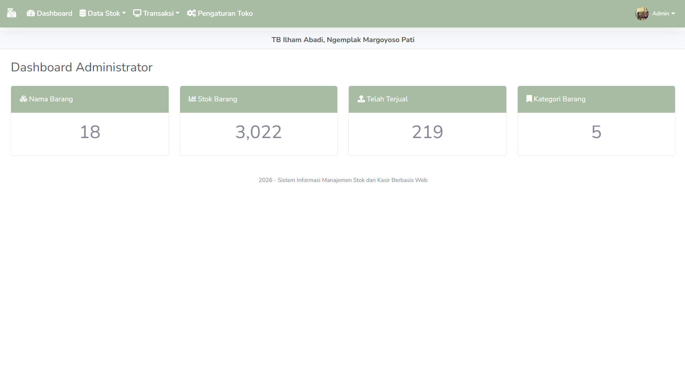

# Sistem Stok dan Kasir Berbasis Web

Sistem Stok dan Kasir Berbasis Web adalah aplikasi yang dirancang untuk membantu proses pengelolaan stok barang dan transaksi penjualan pada toko atau usaha kecil hingga menengah. Aplikasi ini menyediakan fitur manajemen produk, kategori, supplier, transaksi penjualan, serta laporan sehingga proses operasional menjadi lebih cepat dan terorganisir.

## 🌐 Live Demo

**Website:** https://stok-kasir-nathan.freedev.app/

## 📸 Preview



---

## ✨ Fitur

- Login dan Logout Admin
- Dashboard
- Manajemen Produk
- Manajemen Kategori
- Manajemen Supplier
- Manajemen Pelanggan
- Manajemen Stok Barang
- Transaksi Kasir
- Riwayat Transaksi
- Laporan Penjualan
- Cetak Struk
- Manajemen User
- Responsive Interface

## 🛠️ Teknologi

- PHP Native
- MySQL
- HTML5
- CSS3
- Bootstrap
- JavaScript
- jQuery
- XAMPP (Development)

## 📂 Struktur Project

```
├── assets/
├── config/
├── database/
├── pages/
├── uploads/
├── index.php
└── README.md
```

## ⚙️ Instalasi

### 1. Clone Repository

```bash
git clone https://github.com/ecsztassy/Sistem-Stok-dan-Kasir-Berbasis-web.git
```

### 2. Masuk ke Folder Project

```bash
cd Sistem-Stok-dan-Kasir-Berbasis-web
```

### 3. Pindahkan Project

Salin project ke folder:

```
xampp/htdocs/
```

### 4. Import Database

- Jalankan Apache dan MySQL melalui XAMPP.
- Buka phpMyAdmin.
- Buat database baru.
- Import file database `.sql` yang tersedia pada project.

### 5. Konfigurasi Database

Sesuaikan file konfigurasi database.

Contoh:

```php
$host = "localhost";
$user = "root";
$password = "";
$database = "nama_database";
```

### 6. Jalankan Aplikasi

Buka browser dan akses:

```
http://localhost/Sistem-Stok-dan-Kasir-Berbasis-web
```

## 🚀 Deployment

Aplikasi dapat diakses melalui:

https://stok-kasir-nathan.freedev.app/

## 👨‍💻 Author

**Nathan Ahnaf Hafiz**

- GitHub: https://github.com/ecsztassy

## 📄 License

Project ini dibuat untuk tujuan pembelajaran dan pengembangan portofolio.
